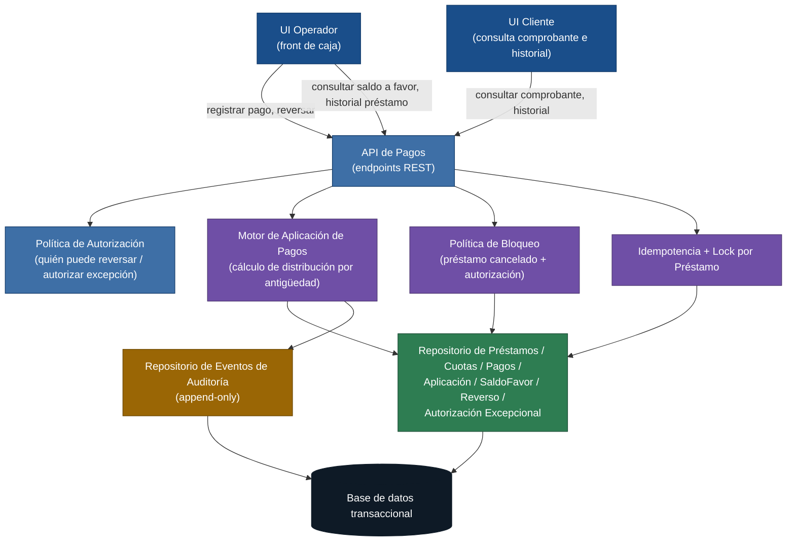

# Arquitectura — Módulo de pagos del fondo de cesantía

> **Producto:** Módulo de aplicación de pagos del fondo de cesantía (MVP).
> **Outcome del MVP:** el operador registra un pago y lo da por bueno en la primera vista, y el cliente consulta su comprobante y se queda tranquilo.
> **Métrica de éxito:** tasa de pagos registrados sin necesidad de revisión manual del operador, complementada por la caída de reclamos por "pago no reflejado" en 7 días.
> **Referencias:** `inbox/mvp-canvas.md`, `inbox/user-stories.md`, `inbox/requisitos.md`, `inbox/personas.md`, `inbox/evidence-map.json`, `outputs/epics.md`, `outputs/stories.md`, `outputs/backlog.json`.

Este documento describe la **estructura técnica** del módulo de pagos para el
MVP. El detalle de cada decisión está en los ADRs; aquí se justifica la
forma del módulo, su vista de datos, y qué cosas **no** se han decidido
todavía. No se escribe código de producción: solo el diagrama, la
descripción de componentes y el "porqué" registrado.

---

## 1. Fuerzas arquitectónicas (resumen)

Estas son las fuerzas que el inbox obliga a satisfacer. Cada una se
resuelve con al menos un ADR (ver §4):

1. **Modelo de datos único para pagos, cuotas, saldo a favor y
   reversos** — para que operador, cliente y supervisor lean la misma
   verdad. (R-05, R-11, R-12, US-01, US-05, US-06, pains
   `estado-no-coincide`, `inconsistencias-financieras`,
   `falta-trazabilidad`.)
2. **Consistencia inmediata entre saldos, cuotas, historial y
   comprobante** tras registrar un pago. (R-11, R-13, US-01, US-03,
   pain `inconsistencias-financieras`.)
3. **Prevención de duplicados por reintento y por concurrencia entre
   operadores** sobre el mismo préstamo. (R-07, US-08, pain
   `pagos-duplicados-concurrencia`.)
4. **Reverso con trazabilidad completa** del pago original y de la
   corrección. (R-08, R-12, US-09.)
5. **Bloqueo de pagos en préstamos cancelados con autorización
   excepcional** trazable. (R-06, US-07, pain `defectos-pagos-parciales`.)
6. **Suite mínima de pruebas repetible** que cubra los siete
   escenarios críticos. (R-15, US-10, pains `defectos-pagos-parciales`,
   `reglas-ocultas`.)
7. **Rendimiento percibido:** comprobante del cliente y del
   operador visibles al instante, sin recargas. (R-13, US-03, pain
   `falta-comprobante-actualizacion`.)

---

## 2. Vista lógica (componentes)

El módulo se organiza en **unidades de responsabilidad** pequeñas y
trazables al inbox. Los nombres son intencionalmente neutros respecto
a la tecnología concreta (no se ata a un framework, un ORM o una base
de datos específica: ese detalle es decisión del Developer en su fase).

**Componentes (descripción breve):**

- **UI Operador (front de caja).** Vista del operador: identifica el
  préstamo, captura el monto, ve el desglose del pago y la
  distribución en la misma pantalla (US-01), dispara el reverso con
  motivo (US-09), consulta la trazabilidad del saldo a favor
  (US-05). Genera y envía la `idempotency_key` por intento de
  operación.
- **UI Cliente.** Vista del cliente: comprobante inmediato (US-03) e
  historial legible (US-04). Es de **lectura**; no genera pagos.
- **API de Pagos.** Punto de entrada HTTP. Expone las operaciones de
  escritura (registrar pago, reversar) y de lectura
  (comprobante, historial, detalle de préstamo, detalle de pago
  para el supervisor). Valida formato y delega en el motor.
- **Política de Autorización.** Decide qué rol puede hacer qué:
  operador registra y revisa; supervisor autoriza excepciones y
  reversos especiales. Esta pieza es la responsable de aceptar o
  rechazar según rol; el detalle fino de roles es decisión del
  equipo de desarrollo y se anota como open question.
- **Motor de Aplicación de Pagos.** Corazon del módulo. Calcula la
  distribución del pago siguiendo el orden "vencidas primero,
  pendientes desde la más antigua" (US-01, US-02 fusionada).
  Produce `AplicaciónCuota` y, si hay excedente, un
  `SaldoFavorEvento` de tipo `generación`.
- **Política de Bloqueo.** Verifica el estado del préstamo
  (US-07): si está cancelado, exige la
  `AutorizacionExcepcional` y registra su uso en el log de
  auditoría.
- **Idempotencia + Lock por Préstamo.** Encapsula la decisión del
  ADR-0003: dedupe por `idempotency_key` y adquiere lock pesimista
  por `Préstamo` durante la transacción de registro o reverso.
- **Repositorio de entidades de negocio.** Persistencia y lectura
  de `Préstamo`, `Cuota`, `Pago`, `AplicaciónCuota`,
  `SaldoFavor`, `SaldoFavorEvento`, `Reverso`,
  `AutorizacionExcepcional`. Es la única vía por la que el motor
  toca la base de datos.
- **Repositorio de Eventos de Auditoría.** Inserta y lee el log
  append-only de eventos (ADR-0004). El supervisor (US-06) lee
  esencialmente de aquí.
- **Base de datos transaccional.** Una sola, con soporte ACID. Es
  la que sostiene la garantía del ADR-0002 (transacción atómica por
  pago). El motor de base concreto (Postgres, MySQL, SQL Server)
  queda a decisión del Developer; este documento no lo ata.

---

## 3. Vista de datos (resumen del modelo)

El detalle está en el **ADR-0001**. Aquí, una vista rápida para que
el equipo de desarrollo reconozca las entidades sin abrir el ADR:

- **`Préstamo`** — raíz. Estado (`activo`, `cancelado`, `cerrado`),
  cliente, condiciones generales. El estado es lo que US-07 consulta
  para bloquear.
- **`Cuota`** — pertenece a un préstamo. `número`, `vencimiento`,
  `monto_esperado`, `monto_pagado`, `saldo_pendiente`. La cuota
  registra **cuánto** se le aplicó, no **cómo**.
- **`Pago`** — el ingreso de dinero. `monto_total`, `fecha_hora`,
  `usuario_operador`, `idempotency_key`, `canal` (en el MVP,
  siempre el front de operador), `autorizacion_excepcional_id`
  opcional. Es inmutable: corregir un pago es un evento nuevo, no
  una edición.
- **`AplicaciónCuota`** — puente entre `Pago` y `Cuota`.
  `monto_aplicado`. Es la fuente de verdad del desglose que el
  operador ve en US-01 y de la auditoría de US-06.
- **`SaldoFavor`** — saldo a favor **disponible** del préstamo.
  Calculado a partir de sus eventos; no se persiste como columna
  acumulable.
- **`SaldoFavorEvento`** — `tipo` (`generación`, `consumo`,
  `anulación`), `monto`, `fecha_hora`, referencias al pago que lo
  originó. Es la fuente de la trazabilidad que pide US-05.
- **`Reverso`** — anulación de un pago. `pago_id` original,
  `motivo`, `usuario_autorizante`, `fecha_hora`. Inmutable.
- **`AutorizacionExcepcional`** — `prestamo_id`, `supervisor_id`,
  `fecha_hora`, `motivo`. Permite que un pago entre a un préstamo
  cancelado (US-07). Existe desde el MVP porque es la base sobre
  la que se podrán construir las reglas especiales de US-11 más
  adelante.
- **`EventoAuditoria`** — log append-only. Ver ADR-0004.

Relaciones clave:

- `Préstamo 1—N Cuota`
- `Préstamo 1—N Pago`
- `Pago 1—N AplicaciónCuota N—1 Cuota`
- `Préstamo 1—1 SaldoFavor 1—N SaldoFavorEvento`
- `Pago 1—0..1 Reverso`
- `Préstamo 1—N AutorizacionExcepcional`
- Cualquier mutación anterior se refleja en `EventoAuditoria`.

---

## 4. Decisiones tomadas (referencias a ADR)

- **ADR-0001 — Modelo de dominio único para el módulo de pagos.**
  Resuelve la duplicación de la verdad entre saldos, cuotas,
  historial y reporte (R-05, R-11, R-12).
- **ADR-0002 — Transacción atómica para registrar y aplicar un
  pago.** Resuelve la consistencia inmediata y la visibilidad sin
  recargas (R-11, R-13, US-01, US-03).
- **ADR-0003 — Idempotencia por clave de operación + lock pesimista
  por préstamo.** Resuelve pagos duplicados por doble clic y por
  concurrencia (R-07, US-08).
- **ADR-0004 — Auditoría como append-only log de eventos de pago.**
  Resuelve la reconstrucción auditable del supervisor y la
  trazabilidad del reverso (R-12, US-06, US-09).
- **ADR-0005 — Suite mínima de pruebas como tests de integración
  automatizados.** Resuelve la cobertura repetible de los siete
  escenarios críticos (R-15, US-10).

---

## 5. Decisiones que NO tomamos (todavía)

Lo siguiente se consideró y se descartó —o se pospuso— para no inflar
el MVP. Cada punto cita el motivo y la fuerza del inbox (o su
ausencia) que lo justifica:

- **No migramos el histórico previo de saldo a favor en esta fase
  arquitectónica.** Lo declara como riesgo el `mvp-canvas.md` y lo
  recoge el Developer en `stories.md` como supuesto. La arquitectura
  no asume nada sobre ese histórico: si la migración del legado
  falla, el modelo del ADR-0001 arranca con saldo a favor desde
  cero. Decisión: queda como acuerdo de equipo en `stories.md` y
  como open question; no requiere cambio de modelo.
- **No soportamos múltiples canales de pago (US-12).** El
  `mvp-canvas.md` lo declara fuera de alcance. Decisión: la entidad
  `Pago` ya incluye un campo `canal` (preparado para esa
  extensión) pero la API y el motor del MVP solo aceptan el canal
  "front de operador". No se construye integración con canales.
- **No implementamos reglas especiales por convenio, refinanciamiento
  ni reestructuración (US-11).** No hay evidencia suficiente en el
  inbox. Decisión: la entidad `AutorizacionExcepcional` (ADR-0001)
  es el primer ladrillo para soportarlas más adelante; el MVP
  no las activa.
- **No usamos event-bus ni cola de mensajes para propagar eventos.**
  ADR-0002 cubre la consistencia con una transacción ACID. Una cola
  o bus añadiría infraestructura sin un beneficio claro en el MVP y
  abriría una ventana de inconsistencia (rompe R-13 y
  `falta-comprobante-actualizacion`). Si en una iteración futura
  se necesitan vistas materializadas o proyecciones asíncronas,
  se introduce; hoy sería sobre-diseño.
- **No construimos tableros gerenciales (US-13).** Explícitamente
  fuera del MVP. Decisión: el log de auditoría (ADR-0004) es el
  insumo natural cuando se construyan, pero no se construyen
  reportes ni dashboards en esta entrega.
- **No decidimos aún el motor de base de datos concreto.** El
  ADR-0002 exige ACID; cualquier base transaccional
  suficientemente madura (PostgreSQL, MySQL/InnoDB, SQL Server) lo
  cumple. La elección concreta es del Developer en su fase y se
  documenta en el sprint plan; no es una decisión de arquitectura
  de producto.
- **No definimos aún la forma concreta de la `idempotency_key`
  (header HTTP, campo en el body, mecanismo de generación en el
  front).** Es un detalle de implementación, no de estructura;
  queda como open question para el Developer.
- **No definimos aún la política de retención del log de auditoría.**
  ADR-0004 fija la inmutabilidad y la cobertura; la ventana de
  retención (meses, años, archivo) la fija el área de cumplimiento
  o el coordinador de proyectos. Queda como open question.

---

## 6. Atributos de calidad

| Atributo | Cómo se garantiza | Trazabilidad |
|---|---|---|
| **Consistencia de datos** (saldos ↔ cuotas ↔ historial ↔ reporte) | Una sola fuente de verdad + transacción atómica | ADR-0001, ADR-0002, R-05, R-11, R-12 |
| **Auditabilidad** (reconstruir meses después) | Log append-only con `usuario`, `fecha_hora`, referencias y payload | ADR-0004, R-12, US-06, US-09 |
| **Rapidez de actualización** (comprobante y desglose al instante) | Transacción ACID que devuelve el desglose en la misma respuesta | ADR-0002, R-13, US-01, US-03 |
| **Prevención de duplicados** (reintento y concurrencia) | `idempotency_key` por intento + lock pesimista por préstamo | ADR-0003, R-07, US-08 |
| **Trazabilidad del reverso** | `Reverso` como entidad inmutable + `SaldoFavorEvento.tipo = anulación` | ADR-0001, ADR-0004, R-08, US-09 |
| **Cumplimiento de política** (préstamos cancelados) | `AutorizacionExcepcional` exigida por la Política de Bloqueo, registrada en el log | ADR-0001, ADR-0004, R-06, US-07 |
| **Cobertura de pruebas** (siete escenarios críticos) | Tests de integración automatizados en el pipeline, build roto si fallan | ADR-0005, R-15, US-10 |
| **Claridad de la información** para el cliente y el operador | Las vistas leen del mismo modelo; el comprobante y el historial salen del log de auditoría | ADR-0001, ADR-0004, R-14, US-03, US-04 |

---

## 7. Open questions para el equipo

Esto es lo que **no** se pudo cerrar con la evidencia del inbox. Lo
resuelve el Scrum Master + Developer en su fase, o una segunda
iteración arquitectónica:

1. **Reverso parcial.** `stories.md` documenta el reverso total
   (US-09). Si el negocio pide reversar solo un subconjunto de
   cuotas de un pago, se necesita una variante (US-09b) y un
   criterio de aceptación nuevo. **Decisión de PO**, no de
   arquitectura, pero el modelo del ADR-0001 lo soporta sin
   cambios.
2. **Política de retención del log de auditoría.** Cuánto tiempo
   se conservan los `EventoAuditoria` y qué se archiva. Lo decide
   el área de cumplimiento o el coordinador de proyectos; el ADR
   no la fija.
3. **Estrategia de migración del histórico previo de saldo a favor.**
   El `mvp-canvas.md` lo declara como riesgo. Si se aborda, la
   decisión técnica (ETL, script SQL, corte y empuje) se toma en
   una fase posterior; la arquitectura del MVP es compatible con
   arrancar desde cero.
4. **Mecanismo concreto de notificación al cliente cuando hay un
   comprobante nuevo.** Push, email, polling dentro de la UI
   cliente, o simplemente la siguiente consulta del cliente.
   El inbox menciona "rapidez de actualización" (R-13) y
   `falta-comprobante-actualizacion`; no especifica el canal de
   aviso. Se decide en la fase de Developer; la arquitectura
   actual lo soporta con la respuesta de la API.
5. **Forma concreta de la `idempotency_key`.** Header HTTP
   recomendado, generación en el front, expiración. Detalle de
   implementación, no de estructura.
6. **Roles y permisos finos dentro de la Política de
   Autorización.** Qué puede hacer un operador junior, qué
   requiere un supervisor, qué puede hacer un Especialista QA
   dentro del sistema (más allá de su poder de veto sobre la
   liberación). Lo cierra el equipo con el Product Owner.
7. **Stack tecnológico concreto.** Framework del backend, ORM o
   no, motor de base de datos, biblioteca de tests. La
   arquitectura no ata; lo decide el Developer documentándolo en
   el sprint plan.
