# Épicas — fondo-cesantia

> Producto: **Módulo de aplicación de pagos del fondo de cesantía**.
> Outcome principal: el operador registra un pago y lo da por bueno en la primera vista, y el cliente, tras pagar, consulta su comprobante y se queda tranquilo.
> Métrica de éxito: tasa de pagos registrados sin necesidad de revisión manual del operador (complementada por caída de reclamos por "pago no reflejado" en 7 días).
> Referencia: `inbox/mvp-canvas.md`, `inbox/user-stories.md`, `inbox/requisitos.md`, `inbox/personas.md`, `inbox/evidence-map.json`.

Las épicas se ordenan por **valor de negocio decreciente**: primero lo que elimina la incertidumbre del cliente y el retrabajo del operador (núcleo visible), después la trazabilidad que cierra la auditoría, y al final los blindajes que sostienen todo en producción. Dentro de cada épica, las historias conservan el orden del MVP (US-01 → US-10).

---

## E-01 · El operador registra el pago y lo da por bueno a la primera vista

**Valor (outcome):** el operador registra un pago contra un préstamo vigente y la distribución entre cuotas (cubiertas, parciales, saldo a favor) aparece clara y verificable en la misma pantalla, de modo que baja la tasa de pagos que requieren revisión manual y se elimina el retrabajo por verificación.
**Origen:** `mvp:mvp-canvas.md#funcionalidades-minimas` · requisitos R-01, R-02, R-03, R-04, R-14 · pains `distribucion-opaca`, `retrabajo-verificacion` · persona Operador de pagos.
**Prioridad:** 1
**Historias:** US-01 *(US-02 se fusionó en US-01 durante el refinamiento del Developer — mismo motor de aplicación, dos criterios integrados; ver `stories.md`)*

---

## E-02 · El cliente paga, ve su comprobante y se queda tranquilo

**Valor (outcome):** el cliente obtiene al instante un comprobante entendible con el efecto del pago sobre su deuda y puede consultar su historial en lenguaje claro, de modo que cae la tasa de reclamos por "pago no reflejado" en los 7 días posteriores al pago.
**Origen:** `mvp:mvp-canvas.md#funcionalidades-minimas` · requisitos R-09, R-10, R-13, R-14 · pains `incertidumbre-post-pago`, `falta-comprobante-actualizacion`, `opacidad-calculo-financiero` · persona Cliente del préstamo.
**Prioridad:** 2
**Historias:** US-03, US-04

---

## E-03 · El operador y el supervisor responden con seguridad sobre el saldo a favor y reconstruyen cualquier movimiento

**Valor (outcome):** el operador explica al cliente el origen y consumo del saldo a favor con evidencia verificable, y el supervisor reconstruye a posteriori cualquier movimiento (quién, cuándo, qué cuotas, montos y reversos), de modo que las inconsistencias financieras se detectan y corrigen antes de propagarse a reportes y contabilidad.
**Origen:** `mvp:mvp-canvas.md#funcionalidades-minimas` · requisitos R-05, R-11, R-12, R-14 · pains `estado-no-coincide`, `inconsistencias-financieras`, `falta-trazabilidad` · personas Operador de pagos, Supervisor de pagos.
**Prioridad:** 3
**Historias:** US-05, US-06

---

## E-04 · El módulo de pagos aguanta producción: bloqueos, duplicados, reversos y suite mínima

**Valor (outcome):** el módulo impide pagos fuera de política (préstamos cancelados), previene duplicados por reintento o concurrencia, permite corregir errores mediante reverso con motivo sin perder trazabilidad, y valida de forma repetible los escenarios críticos antes de cada liberación, de modo que los defectos recurrentes del histórico dejan de colarse en producción.
**Origen:** `mvp:mvp-canvas.md#funcionalidades-minimas` · requisitos R-06, R-07, R-08, R-15 · pains `defectos-pagos-parciales`, `pagos-duplicados-concurrencia`, `reglas-ocultas` · persona Especialista QA (con Operador y Supervisor como usuarios indirectos del reverso).
**Prioridad:** 4
**Historias:** US-07, US-08, US-09, US-10

---

## Diagrama del backlog (épicas → historias)

```mermaid
flowchart TD
  classDef epic fill:#1A4E8A,color:#fff,stroke:#123A68;
  classDef story fill:#6F4FA6,color:#fff,stroke:#4B3470;

  E1[E-01 · Operador registra y valida a la primera]:::epic
  E2[E-02 · Cliente ve comprobante y se queda tranquilo]:::epic
  E3[E-03 · Saldo a favor trazable y auditoría]:::epic
  E4[E-04 · Módulo listo para producción]:::epic

  E1 --> US01[US-01 · Registrar pago y ver distribución en la misma pantalla]:::story
  %% US-02 fusionada en US-01 durante refinamiento

  E2 --> US03[US-03 · Comprobante inmediato para el cliente]:::story
  E2 --> US04[US-04 · Historial legible para el cliente]:::story

  E3 --> US05[US-05 · Trazabilidad del saldo a favor para el operador]:::story
  E3 --> US06[US-06 · Reconstrucción auditable para el supervisor]:::story

  E4 --> US07[US-07 · Bloqueo de pagos en préstamos cancelados]:::story
  E4 --> US08[US-08 · Prevención de duplicados y concurrencia]:::story
  E4 --> US09[US-09 · Reverso con motivo y trazabilidad]:::story
  E4 --> US10[US-10 · Suite mínima de pruebas del módulo]:::story
```

---

## Resumen

- **Épicas:** 4 (E-01, E-02, E-03, E-04).
- **Historias candidatas:** 10 (US-01 … US-10). Quedan explícitamente fuera de este entregable US-11 (reglas especiales por convenio), US-12 (canales distintos al front del operador) y US-13 (reportes y tableros gerenciales), conforme a `mvp-canvas.md#fuera-de-alcance`.
- **Orden de prioridad de las épicas y justificación:**
  1. **E-01** — sin una distribución correcta y visible, no existe el producto; ataca el dolor más caro del operador (retrabajo) y define el motor que el resto consume.
  2. **E-02** — atiende la cara cliente de la misma operación y mueve la métrica principal de negocio (reclamos por "pago no reflejado"); depende conceptualmente de E-01, pero entrega valor de inmediato.
  3. **E-03** — convierte el saldo a favor y la auditoría en evidencia verificable, cerrando la cadena de confianza que el supervisor necesita para no propagar inconsistencias.
  4. **E-04** — indispensable para producción, pero su valor es defensivo (evitar regresiones, duplicados, pagos fuera de política y errores no detectados); va inmediatamente después del núcleo porque sin él el MVP falla en el primer mes.